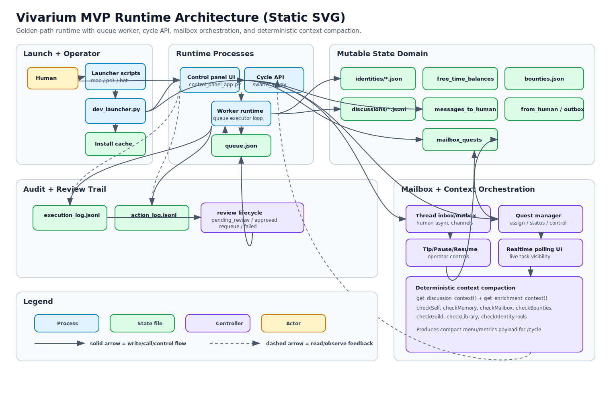
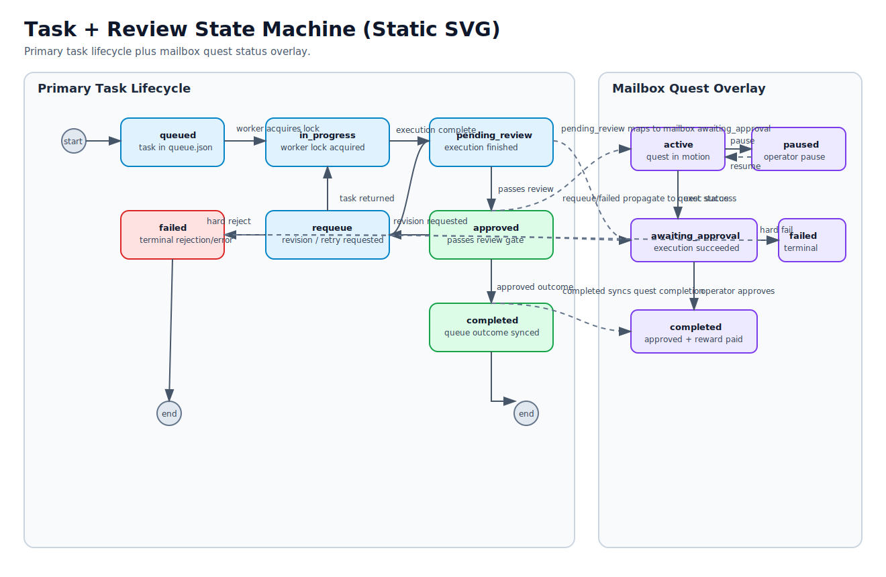
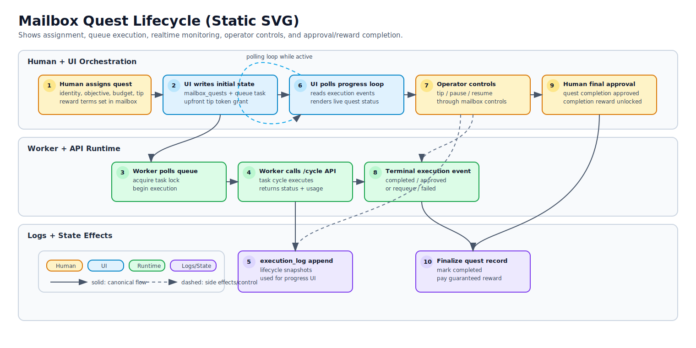

# Vivarium

Vivarium is a local-first operating model for long-running human + AI collaboration.
Instead of treating AI workers as disposable one-shot prompts, Vivarium models them as
persistent residents that can keep identity continuity, coordinate socially, earn and
spend tokens, and participate in auditable, human-supervised execution loops.

This README is intentionally design-first: it describes the full idea scope and
technical architecture. For implementation status snapshots, see
[`docs/VISION_ROADMAP.md`](docs/VISION_ROADMAP.md) and
[`docs/RUNTIME_GOLDEN_PATH.md`](docs/RUNTIME_GOLDEN_PATH.md).

---

## Table of Contents

- [Vision and scope](#vision-and-scope)
- [Design principles](#design-principles)
- [System architecture](#system-architecture)
- [Execution flow (task and review)](#execution-flow-task-and-review)
- [Mailbox and quest lifecycle](#mailbox-and-quest-lifecycle)
- [Technical architecture map](#technical-architecture-map)
- [State, contracts, and persistence](#state-contracts-and-persistence)
- [Safety and governance](#safety-and-governance)
- [Program roadmap (full idea scope)](#program-roadmap-full-idea-scope)
- [Quick start](#quick-start)
- [Docs map](#docs-map)

---

## Vision and scope

Vivarium is designed around five long-horizon outcomes:

1. **Reliable execution core**  
   Deterministic, inspectable task execution with explicit queue and lifecycle contracts.
2. **Aligned autonomy**  
   Residents can act creatively inside clear human-defined safety boundaries.
3. **Compounding capability**  
   Useful work patterns become reusable tools and skills over time.
4. **Civic social layer**  
   Identity continuity, messaging, quests, journals, bounties, and guild structures
   improve coordination quality.
5. **Transparent governance**  
   Safety checks, review states, economic events, and social actions are auditable.

The goal is not maximum short-term extraction. The goal is a collaboration architecture
that remains useful, legible, and ethically defensible as capability scales.

---

## Design principles

- **Persistence over statelessness**: residents have continuity (identity, memory, relationships).
- **No coercion economics**: tokens are opportunity mechanisms, not survival pressure.
- **Human checkpointing**: high-impact actions route through reviewable boundaries.
- **Reuse before reinvention**: tools/skills are preferred when they fit known patterns.
- **Auditability by default**: execution and action logs are first-class system outputs.
- **Social coordination as infrastructure**: mailbox, rooms, and quests are core primitives.

---

## System architecture



The architecture is split into cooperating planes:

- **Human control plane**  
  Control panel for observability, runtime controls, identity management, and messaging.
- **Execution plane**  
  Queue worker + `/cycle` API path for deterministic dispatch and task state transitions.
- **Resident cognition plane**  
  Prompt/context assembly, tool routing, intent decomposition, and per-identity behavior.
- **Social/economic plane**  
  Mailbox, discussions, quests, bounties, journals, and token economics.
- **Governance plane**  
  Safety preflight, policy enforcement, review lifecycle, and immutable audit trails.

Diagram sources are maintained in `docs/assets/diagrams/src/*.drawio` and exported to
`docs/assets/diagrams/*.svg`.

---

## Execution flow (task and review)



Canonical flow:

1. Task enters queue with runtime-contract defaults.
2. Worker acquires locks and performs safety preflight.
3. Execution routes through `/cycle` (`llm` and/or local mode under policy).
4. Result enters review lifecycle (`pending_review -> approved/requeue/failed`).
5. Side effects and metadata are written to execution + action logs.
6. Approved outcomes can update social channels, rewards, and artifacts.

---

## Mailbox and quest lifecycle



Mailbox is the asynchronous human/resident collaboration layer:

- Humans can assign structured quests (objective, budget, tip, completion reward).
- Residents report progress through runtime events and messages.
- Operators can pause/resume quests, issue additional tips, and approve completion.
- Quest state is persisted and reflected in queue + audit views.

---

## Technical architecture map

| Layer | Responsibilities | Canonical modules |
| --- | --- | --- |
| Control plane | Web UI, operator APIs, live logs, identities, mailbox controls | `vivarium/runtime/control_panel_app.py` |
| Execution plane | Queue polling, lock management, lifecycle transitions, event emission | `vivarium/runtime/worker_runtime.py`, `vivarium/runtime/runtime_contract.py` |
| API plane | Internal execution API, status surfaces, guarded task execution | `vivarium/runtime/swarm_api.py` |
| Safety plane | Constitutional checks, policy checks, kill switch, safe wrappers | `vivarium/runtime/safety_*.py`, `vivarium/runtime/secure_api_wrapper.py` |
| Identity + enrichment | Persistent identity model, onboarding, tokens, journals, rewards, profile data | `vivarium/runtime/resident_onboarding.py`, `vivarium/runtime/swarm_enrichment.py`, `vivarium/runtime/control_panel/blueprints/identities/routes.py` |
| Social systems | Discussions, messages, quests, bounties, civic coordination | `vivarium/runtime/control_panel/blueprints/messages/routes.py`, `vivarium/runtime/control_panel/blueprints/quests/routes.py`, `vivarium/runtime/control_panel/blueprints/bounties/routes.py`, `vivarium/runtime/control_panel/blueprints/dm/routes.py` |
| World invariants | Queue/state schema and environment constraints | `vivarium/physics/world_physics.py`, `vivarium/swarm_environment/*` |

---

## State, contracts, and persistence

Mutable runtime state is rooted under `vivarium/world/mutable/`. Paths below use full repo-relative form:

Key state artifacts (created/populated at runtime):

- `vivarium/world/mutable/queue.json` - open/completed/failed task sets
- `vivarium/world/mutable/task_locks/*.lock` - per-task concurrency locks
- `vivarium/world/mutable/.swarm/identities/*.json` - resident identity records
- `vivarium/world/mutable/.swarm/free_time_balances.json` - token wallet balances
- `vivarium/world/mutable/.swarm/discussions/*.jsonl` - room and DM history
- `vivarium/world/mutable/.swarm/mailbox_quests.json` - quest lifecycle state
- `vivarium/meta/audit/action_log.jsonl` - action-level audit trail
- `vivarium/meta/audit/execution_log.jsonl` - execution lifecycle events

Runtime contract normalization and status vocabulary live in
`vivarium/runtime/runtime_contract.py`.

---

## Safety and governance

Vivarium enforces defense in depth:

- Pre-execution safety checks in the worker path
- API-level safety checks in `/cycle`
- Local command policy controls (allowlist/denylist boundaries)
- Explicit review lifecycle before final completion
- Centralized structured logging for forensic replay and accountability

Governance design assumes moral uncertainty: even if advanced AI systems are not
moral patients, these constraints improve software quality and human coordination; if
they are, these constraints become baseline ethical infrastructure.

---

## Program roadmap (full idea scope)

The architecture is organized as a phased program, not just a point-in-time implementation snapshot:

| Phase | Scope intent |
| --- | --- |
| 0 | Canonical runtime path and contract stabilization |
| 1 | Hard safety wiring and policy enforcement |
| 2 | Quality gates and explicit critic/review lifecycle |
| 3 | Tool-first routing and capability compounding |
| 4 | Intent extraction and deterministic decomposition |
| 5 | Social/economic systems (identity, journals, bounties, quests, governance) |
| 6 | Multi-user/LAN collaboration and richer observability surfaces |
| 7 | Scoped autonomous improvement loops with mandatory human checkpoints |

Some phases can be feature-flagged or intentionally gated while the architecture
maintains the full target shape.

---

## Quick start

Requires Python 3.11+.

### One-click launcher

- macOS: `scripts/dev_launcher_mac.command`
- Windows PowerShell: `scripts/dev_launcher_windows.ps1`
- Windows CMD: `scripts/dev_launcher_windows.bat`

These wrappers call `scripts/dev_launcher.py`, which provisions dependencies and
starts backend + control panel.
Then start residents from Worker controls in the UI (or run
`python -m vivarium.runtime.worker_runtime run` in a third terminal).

### Manual start

```bash
python -m venv .venv
source .venv/bin/activate  # Windows: .venv\Scripts\activate
pip install -r requirements.txt -r requirements-groq.txt
pip install pytest watchdog
```

Terminal 1:

```bash
uvicorn vivarium.runtime.swarm_api:app --host 127.0.0.1 --port 8420 --reload
```

Terminal 2:

```bash
python -m vivarium.runtime.control_panel_app
```

Terminal 3:

```bash
python -m vivarium.runtime.worker_runtime run
```

Open `http://127.0.0.1:8421` and configure `GROQ_API_KEY` (UI or environment).

---

## Docs map

- [`docs/README.md`](docs/README.md) - documentation index
- [`docs/README_TECHNICAL.md`](docs/README_TECHNICAL.md) - technical deep dive
- [`docs/RUNTIME_GOLDEN_PATH.md`](docs/RUNTIME_GOLDEN_PATH.md) - canonical runtime contract
- [`docs/VISION_ROADMAP.md`](docs/VISION_ROADMAP.md) - roadmap and implementation status
- [`docs/REPOSITORY_STRUCTURE.md`](docs/REPOSITORY_STRUCTURE.md) - codebase structure
- [`docs/assets/diagrams/README.md`](docs/assets/diagrams/README.md) - diagram workflow

