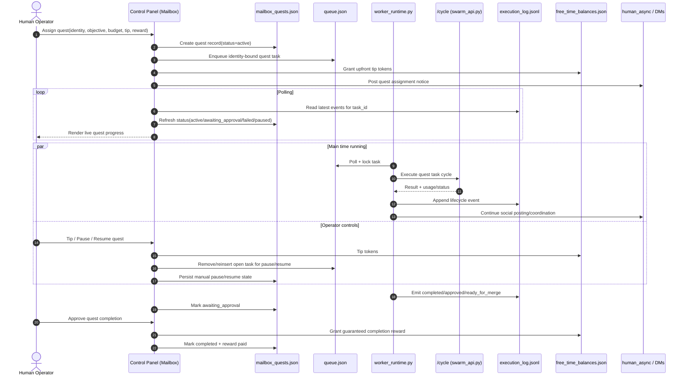
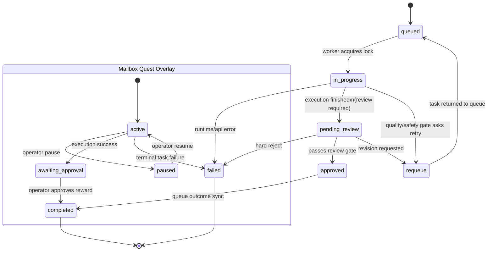

# Vivarium

Vivarium is a local-first, multi-resident runtime with a human control panel.

Core focus right now: **MVP stabilization + real-world testing**.

---

## MVP Status (Now)

Current runtime is functional and testable end-to-end:

- queue-driven execution via worker + API
- persistent resident identities and state
- social channels (rooms + DMs + human async)
- mailbox/phone controls for human-to-resident messaging
- quest flow from mailbox with tips, pause/resume, approval rewards
- detailed audit logging and UI visibility

Operational defaults:

- **Golden-path runtime** is enforced
  - queue + worker + `/cycle` API is the supported path
  - detached spawner path is disabled
- **MVP docs-first mode** remains supported
  - docs/proposals-heavy outputs
  - no autonomous self-mutating git loop

Regression baseline observed in this phase: full pytest suite passing (`63 passed` at latest baseline).

---

## Quick Start (Recommended)

### One-click launcher (cross-platform)

Use one of:

- macOS/Linux: `scripts/dev_launcher_mac.sh`
- Windows PowerShell: `scripts/dev_launcher_windows.ps1`
- Windows CMD: `scripts/dev_launcher_windows.bat`

All wrappers call `scripts/dev_launcher.py`, which:

- creates `.venv` if missing
- installs/updates pip tooling on first run
- installs requirements from `requirements.txt` + `requirements-groq.txt`
- installs testing/runtime helpers (`pytest`, `watchdog`)
- stores install state in `.swarm/dev_install_state.json`
- skips reinstall on next launch unless requirements signature changes
- kills/replaces existing backend/frontend listeners
- starts:
  - backend: `uvicorn vivarium.runtime.swarm_api:app --reload`
  - frontend: `python -m vivarium.runtime.control_panel_app`

Optional:

- set `VIVARIUM_FORCE_REINSTALL=1` to force dependency reinstall.
- set `VIVARIUM_API_PORT` / `VIVARIUM_CONTROL_PANEL_PORT` to override ports (`8420`/`8421`).

---

## Manual Start (If You Prefer)

Requires **Python 3.11+**.

```bash
python -m venv .venv
source .venv/bin/activate
pip install -r requirements.txt -r requirements-groq.txt
pip install pytest watchdog
```

Start backend:

```bash
uvicorn vivarium.runtime.swarm_api:app --host 127.0.0.1 --port 8420 --reload
```

Start UI:

```bash
python -m vivarium.runtime.control_panel_app
```

Start worker:

```bash
python -m vivarium.runtime.worker_runtime run
```

Open:

- `http://127.0.0.1:8421`

Configure Groq key either through:

- `GROQ_API_KEY` environment variable, or
- UI Groq API panel.

---

## Runtime Flow

High-level path:

`queue -> worker runtime -> /cycle API -> execution/action logs -> review lifecycle -> social updates`

Canonical entrypoints:

- `vivarium/runtime/worker_runtime.py`
- `vivarium/runtime/swarm_api.py`
- `vivarium/runtime/control_panel_app.py`

### System Design (MVP Runtime)

```mermaid
flowchart LR
    %% ---------- Human and launch layer ----------
    U[Human Operator]
    LM[dev_launcher.py]
    LS1[dev_launcher_mac.sh]
    LS2[dev_launcher_windows.ps1]
    LS3[dev_launcher_windows.bat]
    CACHE[.swarm/dev_install_state.json]

    U --> LS1
    U --> LS2
    U --> LS3
    LS1 --> LM
    LS2 --> LM
    LS3 --> LM
    LM --> CACHE

    %% ---------- Runtime processes ----------
    subgraph RUNTIME["Runtime Processes (golden path)"]
        UI[control_panel_app.py<br/>:8421]
        API[swarm_api.py<br/>/cycle]
        WR[worker_runtime.py<br/>queue executor]
    end

    LM --> UI
    LM --> API
    U --> UI
    WR <-- poll/lock --> Q[(queue.json)]
    WR -->|dispatch task| API

    %% ---------- Identity/state domain ----------
    subgraph STATE["Mutable State Domain"]
        ID[(.swarm/identities/*.json)]
        BAL[(free_time_balances.json)]
        BQ[(bounties.json)]
        DISC[(discussions/*.jsonl)]
        M2H[(messages_to_human.jsonl)]
        H2M[(messages_from_human.json)]
        OUT[(messages_from_human_outbox.jsonl)]
        MQ[(mailbox_quests.json)]
    end

    WR <--> ID
    WR <--> BAL
    WR <--> BQ
    WR <--> DISC
    UI <--> M2H
    UI <--> H2M
    UI <--> OUT
    UI <--> MQ
    UI <--> Q

    %% ---------- Logging and review ----------
    subgraph AUDIT["Audit + Review Trail"]
        EX[(execution_log.jsonl)]
        AC[(action_log.jsonl)]
        RL[[review lifecycle<br/>pending_review | approved | requeue | failed]]
    end

    WR --> EX
    WR --> AC
    EX --> RL
    RL --> Q
    UI -->|live tail + backfill| AC
    UI -->|quest status from execution events| EX

    %% ---------- Mailbox + quest orchestration ----------
    subgraph MAILBOX["Mailbox / Phone + Quest Orchestration"]
        TH[[Thread inbox/outbox]]
        QM[[Quest manager]]
        TQ[[Tip / pause / resume / approve]]
        RT[[Realtime polling]]
    end

    UI --> TH
    UI --> QM
    UI --> TQ
    UI --> RT
    QM --> MQ
    QM --> Q
    TQ --> BAL
    TQ --> MQ
    TQ --> Q

    %% ---------- Prompt/context compaction ----------
    subgraph CONTEXT["Deterministic Context Compaction"]
        DC[get_discussion_context()<br/>room/DM metrics only]
        EC[get_enrichment_context()<br/>option-tree menu]
        MENU[[checkSelf/checkMemory/checkMailbox/<br/>checkBounties/checkGuild/checkLibrary/checkIdentityTools]]
    end

    WR --> DC
    WR --> EC
    DC --> MENU
    EC --> MENU
    MENU --> API

    %% ---------- Style ----------
    classDef proc fill:#1f2937,stroke:#60a5fa,color:#e5e7eb;
    classDef data fill:#111827,stroke:#34d399,color:#d1fae5;
    classDef note fill:#312e81,stroke:#a78bfa,color:#ede9fe;

    class UI,API,WR,LM,LS1,LS2,LS3 proc;
    class Q,ID,BAL,BQ,DISC,M2H,H2M,OUT,MQ,EX,AC,CACHE data;
    class RL,TH,QM,TQ,RT,DC,EC,MENU note;
```

### Quest Lifecycle (Mailbox -> Completion)



### Task + Review State Machine



---

## Mailbox + Quest Workflow

Mailbox is now the human-facing async phone layer:

- inbound resident messages + unread thread view
- outbound messages from operator to one resident or broadcast
- outbox persistence and thread replay

Quest controls in mailbox:

- assign quest to a specific resident
- set quest budget
- add upfront tip (free-time tokens)
- pause/resume quest manually
- track live quest progress via polling
- approve completion manually and release guaranteed reward

Questing is identity-bound queue work, so residents can continue social interaction while executing tasks.

---

## Context Window Compaction (Implemented)

Resident prompt context was refactored to reduce token bloat with deterministic summaries:

- `get_discussion_context()` now reports compact room/DM metrics (counts, peers, latest activity), not raw transcript dumps.
- `get_enrichment_context()` now emits a programmatic option-tree menu, including:
  - `checkSelf()`
  - `checkMemory()`
  - `checkMailbox()`
  - `checkBounties()` (with computed reward-rate metrics)
  - `checkGuild()`
  - `checkLibrary()`
  - `checkIdentityTools()`

Important: summaries are generated from live state data, not inferred narrative recap.

---

## Persistence + Key State Paths

Primary mutable state:

- `vivarium/world/mutable/`

Important files:

- `vivarium/world/mutable/queue.json`
- `vivarium/world/mutable/task_locks/*.lock`
- `vivarium/meta/audit/execution_log.jsonl`
- `vivarium/meta/audit/action_log.jsonl`
- `vivarium/world/mutable/.swarm/identities/*.json`
- `vivarium/world/mutable/.swarm/discussions/*.jsonl`
- `vivarium/world/mutable/.swarm/messages_to_human.jsonl`
- `vivarium/world/mutable/.swarm/messages_from_human.json`
- `vivarium/world/mutable/.swarm/messages_from_human_outbox.jsonl`
- `vivarium/world/mutable/.swarm/mailbox_quests.json`
- `vivarium/world/mutable/.swarm/bounties.json`
- `vivarium/world/mutable/library/community_library/**`
- `vivarium/world/mutable/library/creative_works/**`

---

## Safety + Review Boundaries

Default runtime path enforces:

- worker safety preflight
- secure API wrapper and budget checks
- local command allowlist/denylist restrictions
- loopback/internal token checks on sensitive API behavior
- review lifecycle states (`pending_review`, `approved`, `requeue`, `failed`)
- auditable execution and action logs

Journal protections:

- journals are private to author
- blind community review uses temporary anonymized excerpts only
- review excerpt context is cleared after vote finalization

---

## Testing

Run full suite:

```bash
python -m pytest -q
```

Skip integration/e2e:

```bash
pytest -q -m "not integration and not e2e"
```

---

## Docs Map

- `docs/README.md` - documentation index
- `docs/RUNTIME_GOLDEN_PATH.md` - canonical runtime contract
- `docs/README_TECHNICAL.md` - technical deep dive
- `docs/VISION_ROADMAP.md` - phased status roadmap
- `docs/CROSS_REPO_TIMELINE.md` - historical timeline

---

## Notes

- `README_VISION.md` contains philosophical framing.
- Project is still experimental; use isolated local environments for testing.

